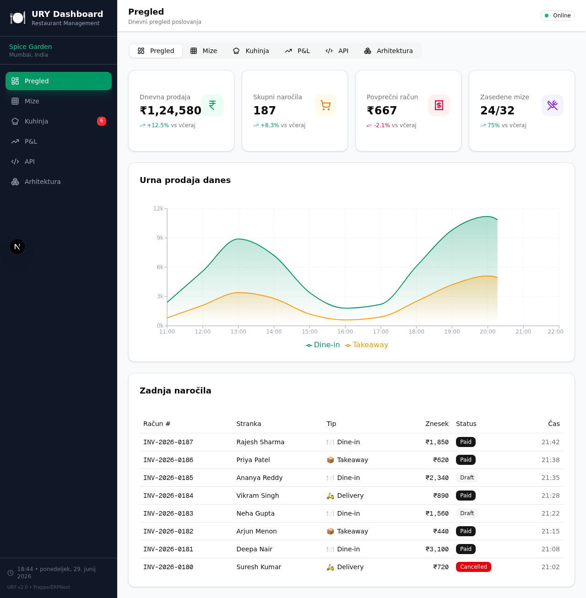

# 🍽️ URY Dashboard — Restaurant Management Evaluation

Interactive evaluation dashboard for the [URY](https://github.com/ury-erp/ury) open-source restaurant management system, built on ERPNext/Frappe.



## ✨ Features

### 📊 6 Interactive Tabs

| Tab | Description |
|---|---|
| **Pregled** | Daily KPI cards, hourly sales chart (dine-in vs takeaway), recent orders table |
| **Mize** | Visual grid of 32 tables across 4 rooms with real-time status updates |
| **Kuhinja** | Live KOT (Kitchen Order Ticket) display with status workflow, audio alerts |
| **P&L** | Daily Profit & Loss with 7-day charts, expense donut, line items |
| **API Explorer** | Searchable catalog of all 36 URY REST API endpoints with parameter details |
| **Arhitektura** | Animated system architecture diagram, 35 doctypes, 7 document event hooks |

### 📡 Real-Time Simulation

- **Socket.io** mini-service simulates restaurant events:
  - New KOT orders every 8-20 seconds
  - KOT status changes every 10-25 seconds
  - Table status changes every 12-30 seconds
- Flash animations, audio beeps, and notification banners for new orders
- Live/Simulation status indicator

### 🎨 Design

- **Dark/Light mode** toggle
- Restaurant-themed color palette (emerald + amber)
- Responsive layout (mobile sidebar overlay, adaptive grids)
- Framer Motion tab transitions and component animations
- Built with shadcn/ui component library

## 🛠️ Tech Stack

| Layer | Technology |
|---|---|
| Framework | Next.js 16 (App Router) |
| Language | TypeScript 5 |
| Styling | Tailwind CSS 4 + shadcn/ui |
| Charts | Recharts |
| State | Zustand |
| Real-time | Socket.io |
| Animations | Framer Motion |
| Icons | Lucide React |
| Backend | Python/Frappe/ERPNext (URY) |

## 🚀 Getting Started

### Prerequisites

- Node.js ≥ 18.20
- bun (or npm/yarn)

### Installation

```bash
# Clone the repo
git clone https://github.com/your-username/ury-dashboard.git
cd ury-dashboard

# Install dependencies
bun install

# Start real-time simulation (optional)
cd mini-services/ury-realtime && bun install && bun run dev &
cd ../..

# Start the dashboard
bun run dev
```

Open [http://localhost:3000](http://localhost:3000) in your browser.

### Real-Time Simulation

The Socket.io mini-service runs on port 3003 and simulates:
- New kitchen orders (KOT)
- Order status changes (preparing → ready → served)
- Table occupancy changes

Without the mini-service, the dashboard runs in **simulation mode** with static mock data.

## 📁 Project Structure

```
src/
├── app/
│   ├── page.tsx              # Main dashboard (single-page app)
│   ├── layout.tsx            # Root layout
│   └── globals.css           # Global styles
├── components/
│   ├── dashboard/
│   │   ├── overview-tab.tsx  # KPI cards + sales chart
│   │   ├── tables-tab.tsx    # Table grid with real-time updates
│   │   ├── kitchen-tab.tsx   # KOT cards with live status
│   │   ├── pl-tab.tsx        # P&L charts and breakdown
│   │   ├── api-explorer-tab.tsx  # 36 API endpoints catalog
│   │   └── architecture-tab.tsx  # System architecture diagram
│   └── ui/                   # shadcn/ui components
├── lib/
│   ├── mock-data.ts          # Restaurant mock data (Spice Garden)
│   └── use-ury-socket.ts     # Socket.io real-time hook
mini-services/
└── ury-realtime/
    ├── index.ts              # Socket.io simulation server
    └── package.json
```

## 🔗 About URY

[URY](https://github.com/ury-erp/ury) is an open-source ERP for restaurant management built on [ERPNext](https://github.com/frappe/erpnext)/[Frappe](https://github.com/frappe/frappe). It includes:

- POS (dine-in, takeaway, delivery, offline mode)
- Kitchen Display System (KDS/KOT)
- Daily P&L and analytics
- Multi-branch support
- QZ Tray thermal printing
- Aggregator integration (Zomato, Swiggy)

## 📄 License

MIT

---

Built with ❤️ for the URY open-source community
